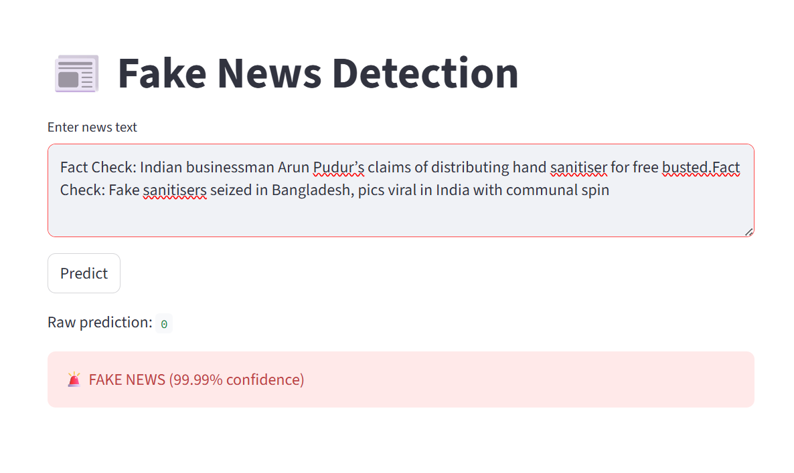

# 📰 TruthLens AI - Fake News Detection System

## Live Demo

[Click Here to Use the App](https://truthlens-ai-fake-news-detection-enn3ekiqccssbyxwxwsf6j.streamlit.app/)

## Project Preview

## Overview
TruthLens AI is an NLP-powered Fake News Detection System that classifies news articles as Real or Fake using Machine Learning techniques.

## Features
- Real-time news classification
- TF-IDF Vectorization
- Machine Learning prediction
- Streamlit Web Application
- Confidence score output

## Technologies Used
- Python
- Pandas
- Scikit-Learn
- NLP
- Streamlit

## Model Performance
Accuracy: 94.69%

## Project Workflow
1. Data Collection
2. Text Preprocessing
3. TF-IDF Feature Extraction
4. Model Training
5. Model Serialization
6. Streamlit Deployment

## Author
Nandusree Diguvasadum
